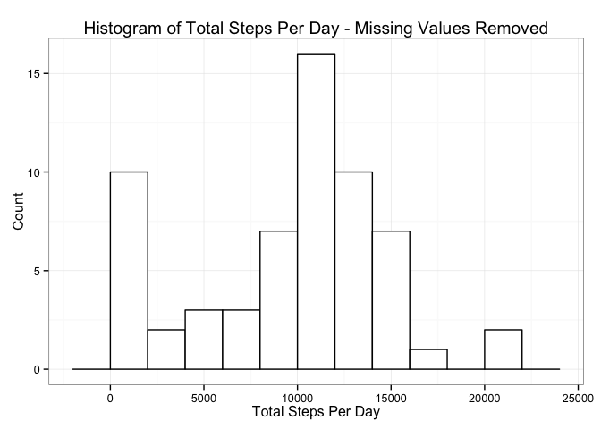
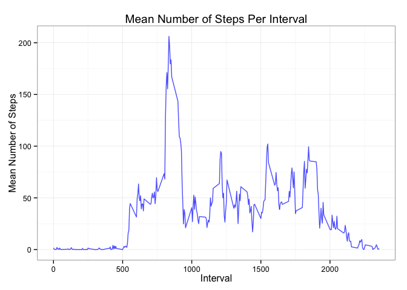

# Reproducible Research: Peer Assessment 1

## Loading and preprocessing the data


```r
setwd("~/Dropbox/RTutorials/Coursera5-ReproducibleResearch/RepData_PeerAssessment1")
unzip("activity.zip")
data <- read.csv("activity.csv", header = TRUE,
                 stringsAsFactors = FALSE)
#create new variable for date as class date
data$date_type <- as.Date(data$date)
```

## What is mean total number of steps taken per day?


```r
library(plyr)
library(ggplot2)
steps_day <- ddply(data, .(date_type), summarise,
                   totalSteps = sum(steps, na.rm = TRUE))

ggplot(steps_day, aes(x=totalSteps)) + 
    geom_histogram(binwidth=2000, colour="black", fill="white") +
    geom_vline(aes(xintercept=mean(totalSteps, na.rm=TRUE)),# Ignore NA values for mean
               color="red", linetype="dashed", size=1) +
    xlab("Total Steps Per Day") + ylab("Count") +
    ggtitle("Histogram of Total Steps Per Day")+
    theme_bw()
```

 

```r
meanSteps <- mean(steps_day$totalSteps, na.rm = TRUE)
medianSteps <- median(steps_day$totalSteps, na.rm = TRUE)
```

The mean number of steps taken per day is 9354, excluding the missing values, while the median number of steps taken per day is 10395.


## What is the average daily activity pattern?


```r
steps_int <- ddply(data, .(interval), summarise,
                   meanSteps = mean(steps, na.rm = TRUE))

ggplot(steps_int, aes(y=meanSteps, x=interval, group = 1)) + 
    geom_line() + geom_point() +
    xlab("Interval") + ylab("Mean Number of Steps") +
    ggtitle("Mean Number of Steps Per Interval")+
    theme_bw()
```

 

```r
maxValue <- max(steps_int$meanSteps)
maxIndex <- which.max(steps_int$meanSteps)
maxInterval <- steps_int[maxIndex,1]
```

The 835th interval is the five-minute interval which contains, on average across all days in the data set, the maximum number of steps, with 206 steps on average.

## Imputing missing values


## Are there differences in activity patterns between weekdays and weekends?
