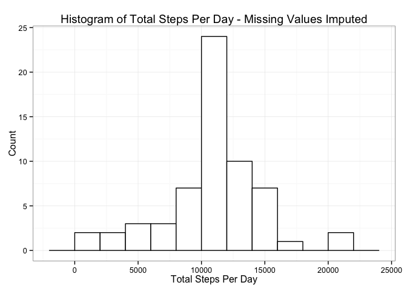
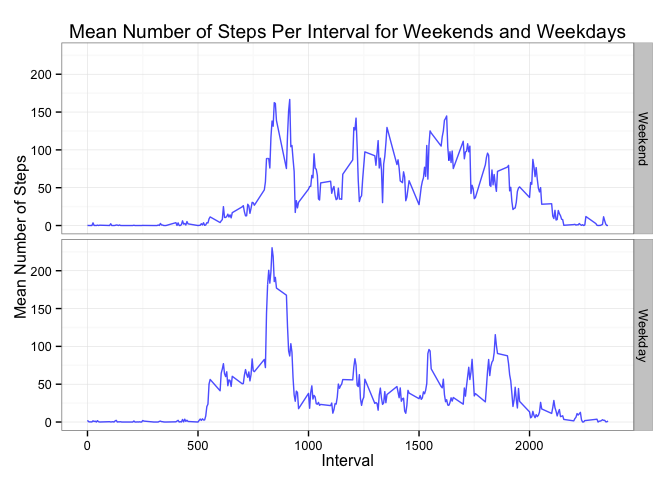

# Reproducible Research: Peer Assessment 1

## Loading and preprocessing the data


```r
options(scipen=999) #to remove scientific notation
setwd("~/Dropbox/RTutorials/Coursera5-ReproducibleResearch/RepData_PeerAssessment1")
unzip("activity.zip")
data <- read.csv("activity.csv", header = TRUE,
                 stringsAsFactors = FALSE)
#create new variable for date as class date
data$date <- as.Date(data$date)
```

## What is mean total number of steps taken per day?


```r
library(plyr)
library(ggplot2)
steps_day <- ddply(data, .(date), summarise,
                   totalSteps = sum(steps, na.rm = TRUE))

ggplot(steps_day, aes(x=totalSteps)) + 
    geom_histogram(binwidth=2000, colour="black", fill="white") +
    geom_vline(aes(xintercept=mean(totalSteps, na.rm=TRUE)),# Ignore NA values for mean
               color="red", linetype="dashed", size=1) +
    xlab("Total Steps Per Day") + ylab("Count") +
    ggtitle("Histogram of Total Steps Per Day")+
    theme_bw()
```

 

```r
meanSteps <- mean(steps_day$totalSteps, na.rm = TRUE)
medianSteps <- median(steps_day$totalSteps, na.rm = TRUE)
```

The mean number of steps taken per day is 9354, excluding the missing values, while the median number of steps taken per day is 10395.


## What is the average daily activity pattern?


```r
steps_int <- ddply(data, .(interval), summarise,
                   meanSteps = mean(steps, na.rm = TRUE),
                   sdSteps = sd(steps, na.rm = TRUE))

ggplot(steps_int, aes(y=meanSteps, x=interval, group = 1)) + 
    geom_line() + geom_point() +
    xlab("Interval") + ylab("Mean Number of Steps") +
    ggtitle("Mean Number of Steps Per Interval")+
    theme_bw()
```

 

```r
maxValue <- max(steps_int$meanSteps)
maxIndex <- which.max(steps_int$meanSteps)
maxInterval <- steps_int[maxIndex,1]
```

The 835th interval is the five-minute interval which contains, on average across all days in the data set, the maximum number of steps, with 206 steps on average.

## Imputing missing values

I will impute based on the average for the given interval across the other days that do not have missing values.


```r
#get index of rows containing NA values for steps
ind <- which(is.na(data), arr.ind = TRUE)
ind_rows <- ind[,1]

#create a vector int_means with averages for each interval across days
#repeated 61 times to match average for the interval with value for each day
int_means <- rep(steps_int$meanSteps,61)

#copt data into data_filled and then
#replace NA values (as indicated by ind_rows) with means from int_means
data_filled <- data
data_filled$steps[ind_rows] <- int_means[ind_rows]

#histogram of total steps with imputed NA values
steps_day_filled <- ddply(data_filled, .(date), summarise,
                   totalSteps = sum(steps))

ggplot(steps_day_filled, aes(x=totalSteps)) + 
    geom_histogram(binwidth=2000, colour="black", fill="white") +
    geom_vline(aes(xintercept=mean(totalSteps)),# Ignore NA values for mean
               color="red", linetype="dashed", size=1) +
    xlab("Total Steps Per Day") + ylab("Count") +
    ggtitle("Histogram of Total Steps Per Day - Missing Values Imputed")+
    theme_bw()
```

 

```r
meanSteps_filled <- mean(steps_day_filled$totalSteps)
medianSteps_filled <- median(steps_day_filled$totalSteps)
meanSteps_filled; medianSteps_filled
```

```
## [1] 10766.19
```

```
## [1] 10766.19
```

With the imputed values, the mean and median are equivalent: mean = 10766 and median = 10766. By imputing the missing values using the mean number of steps for the given interval across the other days, the mean and median number of steps taken per day has increased from the estimates calculated when we excluded missing values (estimates excluding missing values: mean = 9354 and median = 10395).

## Are there differences in activity patterns between weekdays and weekends?


```r
library(dplyr)
```

```
## 
## Attaching package: 'dplyr'
## 
## The following objects are masked from 'package:plyr':
## 
##     arrange, count, desc, failwith, id, mutate, rename, summarise,
##     summarize
## 
## The following object is masked from 'package:stats':
## 
##     filter
## 
## The following objects are masked from 'package:base':
## 
##     intersect, setdiff, setequal, union
```

```r
#create a variable with the actual weekday label to confirm 
#that weekend/weekday classification is done correctly
data_filled$date_type <- weekdays(data_filled$date)

#create a variable to label weekend/weekday
data_filled <- mutate(data_filled, 
                       Weekday_Type = (ifelse(weekdays(date) %in% c("Saturday", "Sunday"), "Weekend", "Weekday")))

data_filled$Weekday_Type <- factor(data_filled$Weekday_Type, levels = c("Weekend", "Weekday"))

steps_int_weekend <- ddply(data_filled, .(interval,Weekday_Type), 
                           summarise,
                           meanSteps = mean(steps))

ggplot(steps_int_weekend, aes(y=meanSteps, x=interval, group = 1)) + 
    geom_line(alpha = 0.7) + geom_point(alpha = 0.7) +
    facet_grid(Weekday_Type~.) +
    xlab("Interval") + ylab("Mean Number of Steps") +
    ggtitle("Mean Number of Steps Per Interval for Weekends and Weekdays")+
    theme_bw()
```

 

```r
#Examine differences between weekdays and weekends
weekend_step_data <- group_by(steps_int_weekend, Weekday_Type)
weekend_summary <- summarise(weekend_step_data, Max = max(meanSteps), 
          Min = min(meanSteps), 
          Mean = mean(meanSteps))
```

In comparing activity patterns between weekdays and weekends, an interesting pattern emerges. Although the maximum number of steps by interval is greater on weekdays (230.3781971) than on weekends (166.6391509), the average number of steps across intervals is greater on weekends (35.6105812) than on weekdays (35.6105812).
